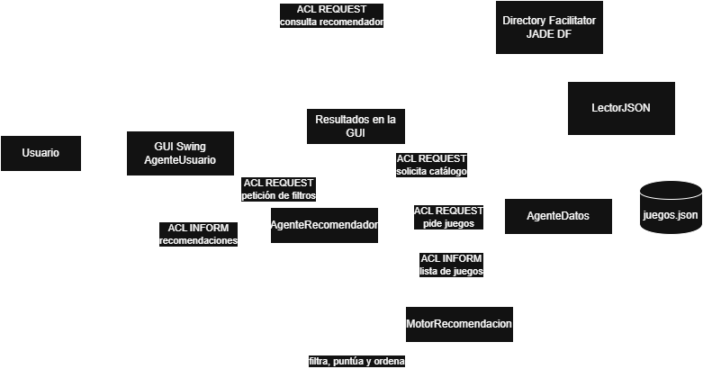

# Sistema Multiagente de Recomendacion de Videojuegos

Proyecto desarrollado con **JADE** y **Java Swing** para recomendar videojuegos a partir de filtros seleccionados por el usuario.

## Requisitos

- Java JDK 8 o superior.
- Eclipse configurado con soporte para proyectos Java.
- No es necesario descargar librerias externas ya que están incluidas en la carpeta `lib/`.

## Estructura del proyecto

- `src/`: codigo fuente del sistema multiagente.
- `resources/`: fichero JSON con el catalogo de videojuegos.
- `lib/`: dependencias del proyecto, incluyendo JADE y Gson.
- `bin/`: clases compiladas.

## Diagrama de la Arquitectura



## Instalacion en Eclipse

1. Abrir Eclipse.
2. Importar el proyecto en la opción **Existing Projects into Workspace**
3. Seleccionar la carpeta raiz del proyecto.
4. Comprobar que el proyecto reconoce la carpeta `lib/` como dependencias del classpath.
5. Verifica que el proyecto use un JDK y no solo un JRE.

## Como ejecutar el proyecto

1. Abrir la clase principal: `src/main/Principal.java`.
2. Ejecutar la clase como **Java Application** (dentro de la pestaña `Run` - `Run As`).
3. Esto iniciará los agentes:
   - `datos`
   - `recomendador`
   - `usuario`
4. Se abrira la interfaz grafica de recomendacion.

## Ejecucion con la GUI de administracion de JADE

Para abrir la ventana de administracion de JADE, hay que añadir el argumento de programa:

```text
--rma
```

En Eclipse:

1. Ir a `Run` - `Run Configurations...`
2. Seleccionar la configuracion de `Principal`
3. En la pestaña **Arguments**, escribir `--rma` en el apartado de **Program arguments**.
4. Ejecutar de nuevo el programa.

## Uso de la aplicacion

1. Seleccionar uno o varios generos (para seleccionar varios generos hay que pulsar Ctrl + Click Izq).
2. Seleccionar una o varias plataformas (para seleccionar varias plataformas hay que pulsar Ctrl + Click Izq).
3. Indicar la puntuacion minima.
4. Indicar el año minimo de lanzamiento.
5. Elegir el numero maximo de resultados a mostrar.
6. Pulsa Obtener recomendaciones.

## Funcionamiento del sistema

- `AgenteDatos` carga el catalogo desde `resources/juegos.json`y ofrece el servicio`datos-videojuegos`.
- `AgenteRecomendador` consulta al agente de datos y calcula las recomendaciones.
- `AgenteUsuario` muestra la interfaz grafica y envia las peticiones al recomendador.

## Notas

- Si el puerto 1099 esta ocupado, `Principal` intentará levantar JADE en puertos alternativos.

